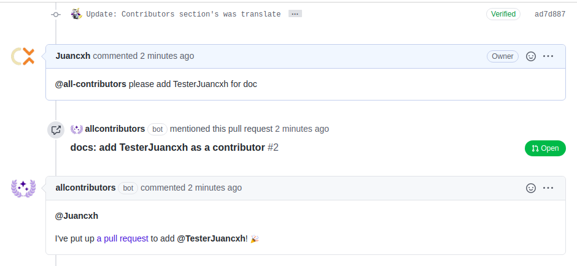
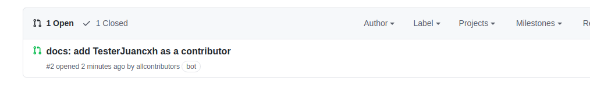
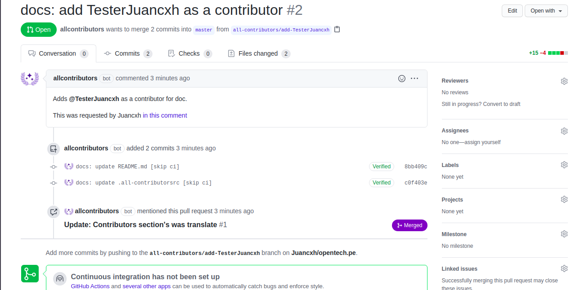
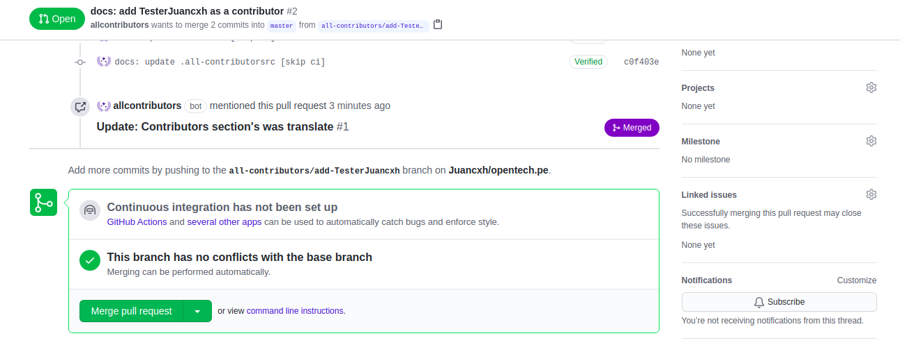
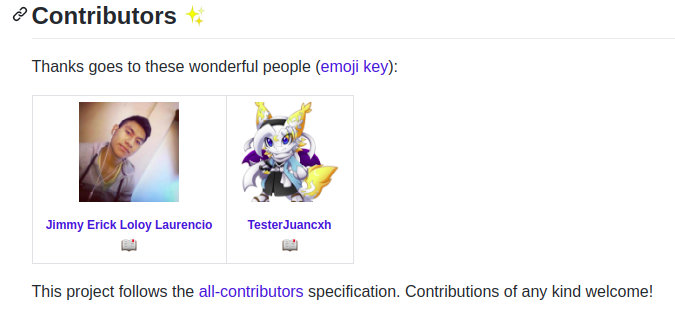

Este es una guia posterior a la que tiene All Contributors en su documentación

Para la automatización se tiene que tener claro que para agregar al contribuidor el owner o creador del repositorio mediante un comentario antes de hacer el pull request tiene que poner lo siguiente:

```
@all-contributors please add <username> for <contributions>
```


Luego de ello el bot mandará un pull request



Si lo abrimos tendremos esta vista:



Ahora para que se visualice al colaborador tenemos que hacerle un merge pull request



Y eso sería todo, luego automaticamente aparecerá nuestro contribuidor en el readme



# All-contributors
<!-- ALL-CONTRIBUTORS-BADGE:START - Do not remove or modify this section -->
[](#contributors-)
<!-- ALL-CONTRIBUTORS-BADGE:END -->
## Contributors ✨

Thanks goes to these wonderful people ([emoji key](https://allcontributors.org/docs/en/emoji-key)):

<!-- ALL-CONTRIBUTORS-LIST:START - Do not remove or modify this section -->
<!-- prettier-ignore-start -->
<!-- markdownlint-disable -->
<!-- markdownlint-restore -->
<!-- prettier-ignore-end -->
<!-- ALL-CONTRIBUTORS-LIST:END -->

This project follows the [all-contributors](https://github.com/all-contributors/all-contributors) specification. Contributions of any kind welcome!
